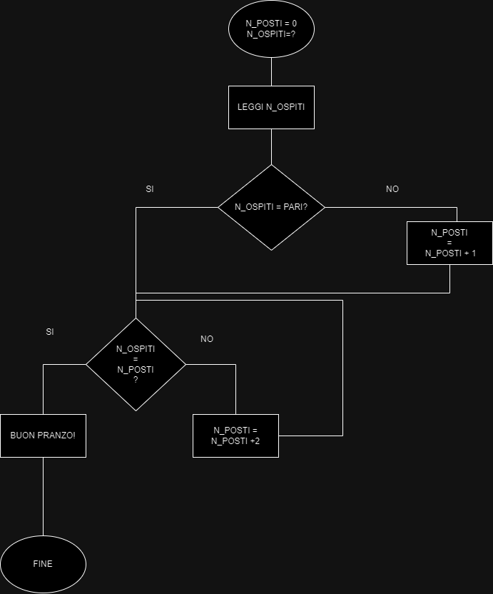

#Ci s(t)iamo tutti?

##Problema:
**Per il pranzo di Natale, diamo una mano a nonna per preparare la tavola: zio Rino, la piccola Emy, zia Lucia e nonno Carlo… siamo davvero in tanti!
Non sarà un pranzo formale, perciò non servono i segnaposto con i nomi, però dobbiamo verificare che ci sia un posto per ciascuno. Per essere più rapidi contiamo i posti a tavola di 2 in 2 e ci accorgiamo che avevamo dimenticato un posto!**

Dati:
N_Posti = 0
Input: N_Ospiti

##Risoluzione
1. Leggi N_Ospiti
2. SE N_Ospiti è pari
    Vai al punto 3
    ALTRIMENTI
    Aggiungi 1 a N_Posti
3. SE N_Ospiti è uguale a N_Posti
    Buon Pranzo!
    ALTRIMENTI
    Aggiungi 2 a N_Posti
    Vai al punto 3

    